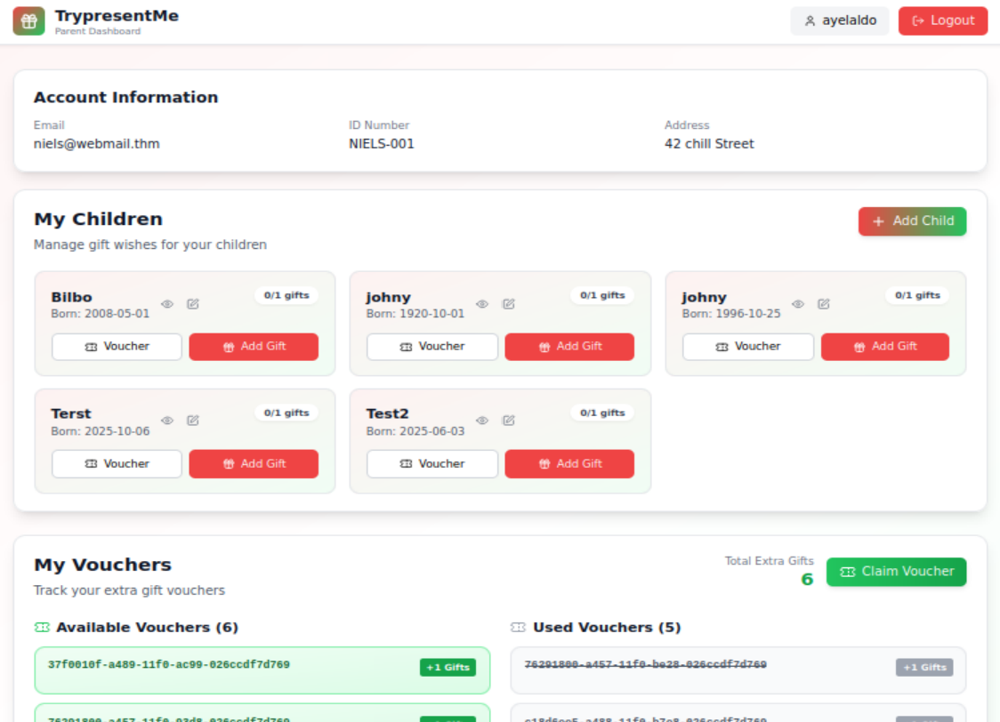
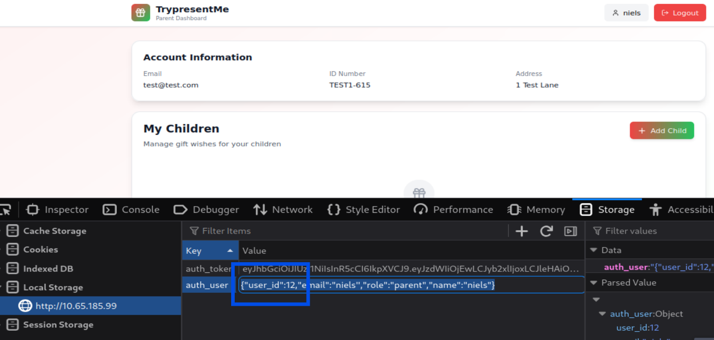
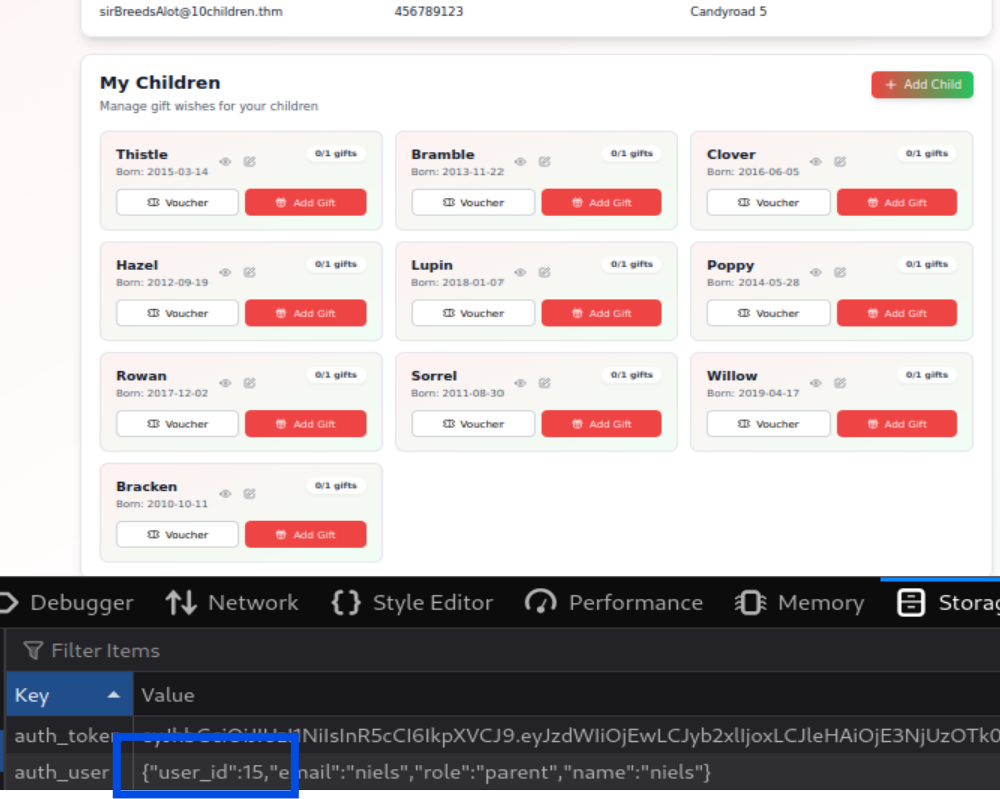
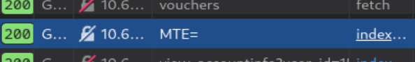
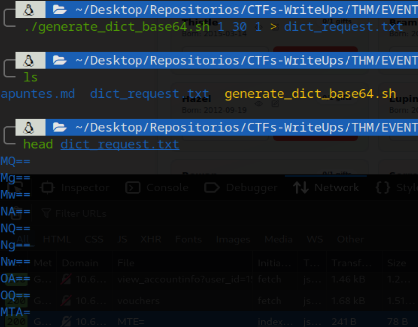
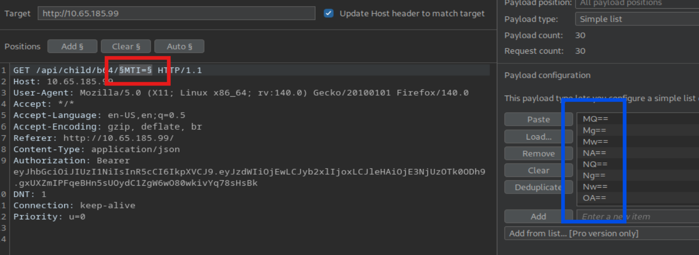

# Day 5 - IDOR 

## Context

After logging in with the credentials given by THM, we have a web app for sending presents. 

The web app has a vulnerability in the parameters of the requests. The parameters refer to the `user_id` in plain text, base64 or MD5. The problem is the server doesn't verify the access permissions.

EXAMPLE: The original `user_id` we have is the information from `user_id=10`. When we inspect at network behavior, we realize the app sent a request to the server but we can change it in the local storage. So, the next image is result we have after changing the `user_id` in the request and refreshing the page.

## Questions

### What does IDOR stand for?

R: Insecure Direct Object Reference

### What type of privilege escalation are most IDOR cases?

R: Horizontal

### Exploiting the IDOR found in the view_accounts parameter, what is the user_id of the parent that has 10 children?

R: 15

After applying brute force manually in the user_id requests, we have the answer.

### Bonus Task: If you want to dive even deeper, use either the base64 or md5 child endpoint and try to find the id_number of the child born on 2019-04-17? To make the iteration faster, consider using something like Burp's Intruder. If you want to check your answer, click the hint on the question.
 
R: 19

Besides the plain-text `user_id` parameter, the site has two similar vulnerabilities involving Base64-encoded and MD5-based endpoints, in the View and Edit buttons in the child section, respectively.​

> The MTE= refers to 11 decimal.

So, we do not know the total number of child references stored on the server, so we are going to use Burp Suite to automate requests by iterating over the Base64-encoded parameter.

Before doing that, I created a script that returns a list of Base64-encoded values for a given range of numbers. In this case, we are going to try the range 1–30, stepping one by one. The output will be redirected to a file named `dict_request.txt` that we will use as a dictionary or wordlist in Burp Suite.

In Burp, we intercept the request when clicking in  view details of any child section and we sent it to intruder to config the automation. We set the variable request and the dictionary we gonna use.

Finally, we look for the response thath contains the child with that brithdate asked in the question. We answer is the 19th child.

