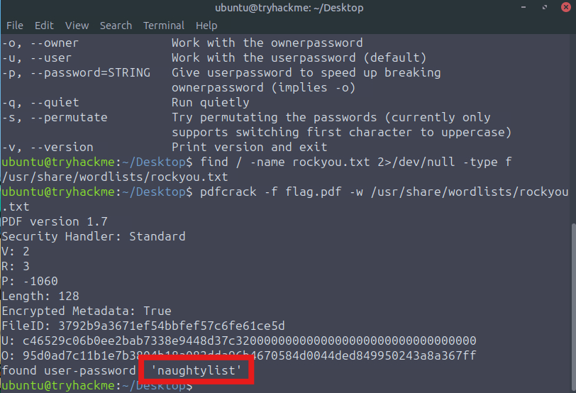
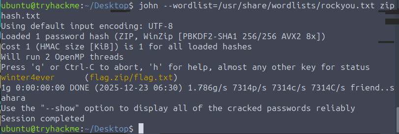

# Passwords - A cracking Christams

## PDF

Usando Wordlist `rockyou.txt`

```shell
pdfcrack -w /usr/share/wordlist/rockyou.txt -f file.pdf
```



## ZIP

Primero, se usa `zip2john` para que `john` no tenga problemas con interpretar el archivo comprimido.

`zip2john flag.zip > ziphash.txt`

Finalmente, se hace la búsqueda de la contraseña con `john` y la wordlist `rockyou.txt`



winter4ever