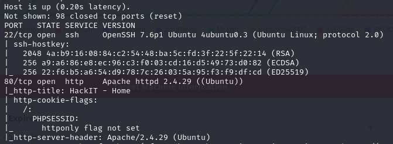
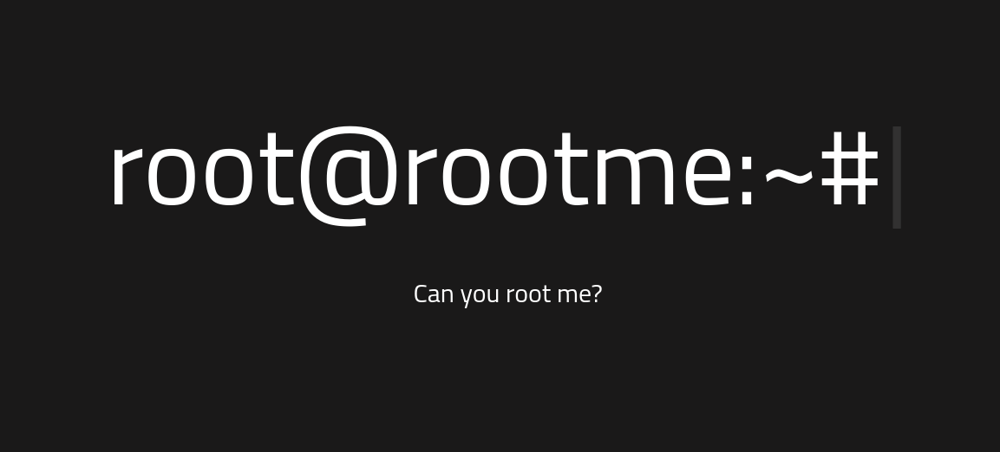
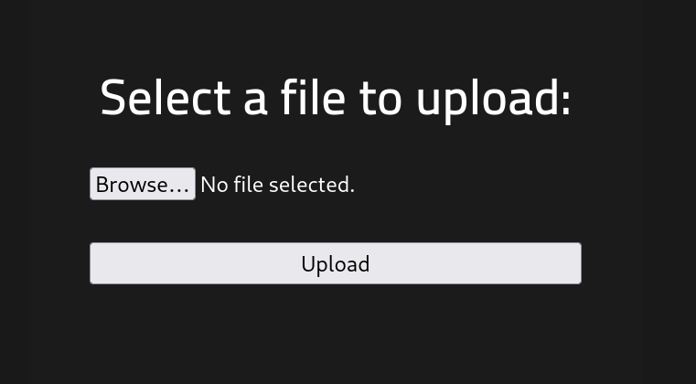
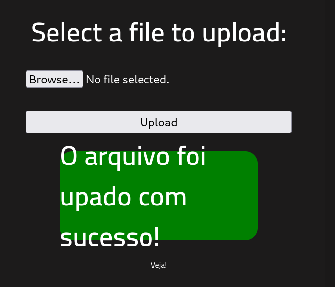
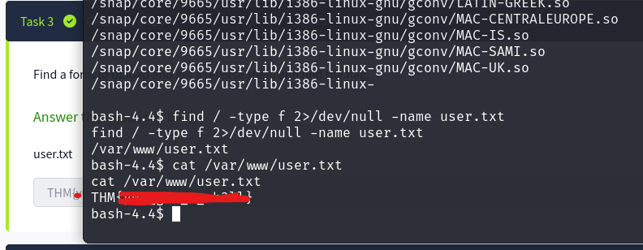

# RootMe
> Máquina de nivel **fácil** en TryHackMe. El objetivo es obtener acceso inicial mediante una vulnerabilidad en PHP y luego escalar privilegios a root explotando permisos indebidos.

**Tags:** `reverse shell` `priv esc` `php` 

[1. Enumeración](#enumeración)  
[2. Reverse Shell](#reverse-shell)  
[3. Priv Esc](#priv-esc)  
[4. Notas Finales](#notas-finales)

## Enumeración

Para comenzar, hacemos un escaneo rápido usando `nmap`.
```shell
sudo nmap -sS -Pn -A 10.10.120.74 --top-ports 100
```

Despliega dos puertos abiertos *(SSH y HTTP)*.  



Usando esta información, procedemos a buscar en el navegador.



Al inspeccionar la página no notamos gran cosa. Sin embarago, podemos usar una buena herramienta para encontrar directorios públicos. Para esto, usamos `dirsearch`.

```shell
dirsearch -u http://10.10.120.74/
```

Como resultado, obtenemos 3 directorios abiertos.
- CSS/
- panel/
- uploads/


Al hacer una búsqueda sobre estos directorios sobre nuestro index, nos damos cuenta que los directorios ***panel*** y ***uploads*** nos sirven.

1. ***Panel***: Nos permite cargar archivos.

    

2. ***Uploads***: Vacío (por el momento). Mas adelante nos ayudará a recuperar los archivos subidos.

    


### Panel

Al jugar un rato en el directorio `panel/`, nos damos cuenta que está sanitizado (no del todo), ya que no permite cargar archivos ejecutables. Se hizo la prueba con una captura de pantalla y el resultado fue el siguiente

- Carga de archivo en formato `.png` en `panel`.



- Recuperar archivo en `uploads`


Una vez corroborado esto, buscamos alguna forma de obtener un reverse shell a través de algún archivo ejecutable.

## Reverse Shell

Para confirmar el lenguaje que maneja el backend, se utiliza una extensión llamada `wappalyzer`.


> El lenguaje usado es ***PHP***. Posibles extensiones: `.php`, `.phtml`, `.php3`, `.php4`, `.phps`.

Después de un rato, notamos que la máquina efectivamente acepta archivos con extensión `.phtml`.

Procedemos a buscar algún payload para usar una reverse shell a nuestra computadora.

Nos ayudamos de [Revshells Generator](https://www.revshells.com/) para encontrar algún payload que nos ayudé a crear la reverse shell. Para esto ponemos a nuestra computadora a escuchar en algún puerto (en mi caso usaré el 4444). En este caso, usamos un ***payload*** de PHP de ***PentestMonkey***.


---


Una vez escuchando sobre este puerto y el payload cargado, procedemos a hacer clic sobre él (en mi caso `payload4.phtml`) y automáticamente el servidor web ejecutará el código.


***Y ESTAMOS DENTRO***

Una vez dentro, procedemos a buscar la bandera. La propia plataforma nos dice que se encuentra en el archivo `user.txt`.

Usamos el siguiente comando para filtrar:

```shell
find / -type f -name user.txt 2>/dev/null
```



## Priv Esc

Para poder escalar privilegios, exploraremos un rato la máquina y después de un rato, notamos que existen cosas de las que nos podemos agarrar en los permisos.

Para ello, se uso el comando siguiente

```shell
find / -perm -4000 2>/dev/null
```

Lo que encontramos son todas los archivos, directorios, etc. que tienen privilegios de root. Lo que no salta la espina es `python`.


Confirmamos que podemos usar python desde ese usuario...

Después, cuando confirmamos que ***Python*** puede ser ejecutado por nosotros usamos un payload para escalar desde Python y ***VUALÁ***...


Finalmente buscamos las banderas faltantes como root y terminamos con la máquina.


## Notas finales

Esta es la primera máquina que pwneé, le tengo mucho cariño. 

Mis agradecimientos a Isaac, me ha dado buena guiada en CTFs.
